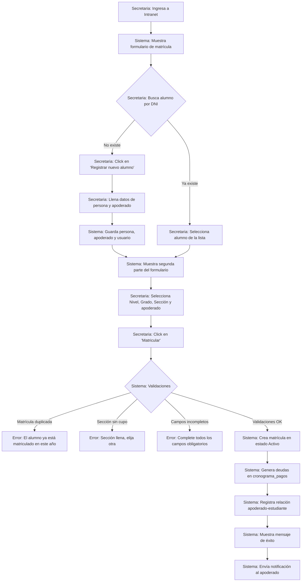
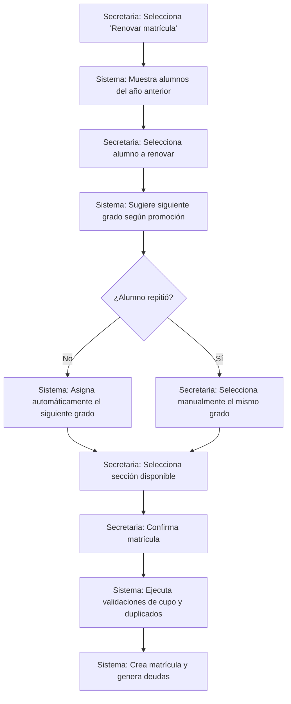

markdown
# Flujo: Proceso de Matrícula

## 1. Diagrama de Actividad

# Flujo alternativo: Renovación de alumno antiguo

# 2. Actores Involucrados

-	Secretaria (o personal administrativo con rol autorizado)
-	Sistema (Backend)
-	Base de datos
-	Apoderado (recibe notificación al finalizar)

# 3. Precondiciones

-	Año lectivo creado y en estado "Abierto" o "Planificación".
-	Niveles, grados y secciones configurados para ese año.
-	Aulas con capacidad definida.
-	Conceptos de pago (matrícula, pensiones) creados para el año lectivo.
-	Usuario autenticado con rol "Secretaria" o "Admin".

## 4. Descripción Paso a Paso

### Flujo principal (alumno nuevo)

**Secretaria** → Ingresa a la intranet → Módulo **“Matrículas”** → Click en **“Nueva Matrícula”**.

**Sistema** → Muestra formulario de matrícula con:
- Selector de **Año Lectivo** (por defecto el activo).
- **Buscador de Alumno** (por DNI o apellidos).

**Secretaria** → Busca al alumno.

- **Si no existe** → Click en **“Registrar nuevo alumno”**:
  - Llena datos de persona:
    - Nombres
    - DNI
    - Fecha de nacimiento
    - Dirección
    - Teléfono
    - Correo
  - Llena datos de apoderado(s):
    - DNI
    - Nombres
    - Parentesco
    - Ocupación
    - Teléfono
  - Click en **“Guardar y continuar”**.

- **Si existe** → Selecciona al alumno de la lista de resultados.

**Sistema** → Muestra segunda parte del formulario:
- **Nivel** (selector).
- **Grado** (cascada: al seleccionar nivel, se filtran los grados).
- **Sección** (según grado seleccionado, muestra secciones con cupo disponible).
- Checkbox **“Apoderado ya registrado”** o formulario para agregar nuevo apoderado.
- Selector de apoderado(s) asociados al alumno.

**Secretaria** → Completa los datos y presiona **“Matricular”**.

**Sistema** → Ejecuta validaciones (ver sección 5).

- **Si todas las validaciones son OK**:
  - Crea el registro en tabla `matricula` con estado **“Activo”**.
  - Genera automáticamente las deudas en `cronograma_pagos` para cada `concepto_pago` del año lectivo con su fecha de vencimiento.
  - Registra la relación apoderado–estudiante en `apoderado_estudiante`, si es nueva.
  - Muestra mensaje de éxito con los detalles de la matrícula.
  - Envía notificación al apoderado (correo electrónico o push) con el resumen de matrícula y pagos pendientes.

---

### Flujo alternativo (renovación de alumno existente)

**Secretaria** → Selecciona **“Renovar matrícula”** en el módulo.

**Sistema** → Muestra lista de alumnos con matrícula en el año anterior, indicando su estado (promovido, repitente, etc.).

**Secretaria** → Selecciona al alumno a renovar.

**Sistema** → Sugiere el siguiente grado según el resultado del año anterior:
- **Si fue promovido**: asigna automáticamente el grado siguiente (ej. de 1° a 2°).
- **Si repitió**: la secretaria selecciona manualmente el mismo grado.

**Secretaria** → Selecciona la sección disponible para ese grado y confirma.

**Sistema** → Ejecuta las mismas validaciones y genera la nueva matrícula y deudas.

---

## 5. Validaciones y Reglas de Negocio

| # | Regla | Descripción |
|---|------|-------------|
| 1 | Unicidad de matrícula activa | Un estudiante solo puede tener una matrícula con estado **“Activo”** por año lectivo. Se valida antes de insertar. |
| 2 | Capacidad del aula | La cantidad de matrículas activas en una sección (`COUNT`) debe ser menor que `aula.capacidad`. |
| 3 | Campos obligatorios | DNI, nombres, apellidos y fecha de nacimiento del alumno. Al menos un apoderado con parentesco definido. |
| 4 | DNI único | El DNI de la persona debe ser único en todo el sistema. |
| 5 | Generación automática de deuda | Al crear la matrícula, el sistema lee todos los `concepto_pago` del año lectivo y genera un registro en `cronograma_pagos` por cada uno, con fecha de vencimiento calculada. |
| 6 | Relación apoderado–estudiante | Un alumno puede tener múltiples apoderados y viceversa. Se debe registrar el parentesco. |
| 7 | Transaccionalidad | Todo el proceso debe ejecutarse en una única transacción. Si algo falla, se realiza rollback completo. |

---

## 6. Tablas Afectadas

| Paso | Tabla | Operación |
|-----|-------|-----------|
| Registrar nuevo alumno | `persona`, `estudiante` | INSERT |
| Registrar nuevo apoderado | `persona`, `apoderado`, `usuario` | INSERT |
| Asociar apoderado existente | `apoderado_estudiante` | INSERT |
| Matricular | `matricula` | INSERT |
| Generar deuda automática | `cronograma_pagos` | INSERT múltiple |
| Verificar cupo | `aula`, `matricula` | SELECT (COUNT) |
| Buscar alumno existente | `persona`, `estudiante` | SELECT |
| Notificar | `usuario` | SELECT |

---

## 7. Endpoints de la API

| Método | Ruta | Descripción |
|-------|------|-------------|
| GET | `/api/anios/activo` | Obtener el año lectivo activo actual |
| GET | `/api/niveles` | Listar todos los niveles (Inicial, Primaria, Secundaria) |
| GET | `/api/grados?nivel_id={id}` | Listar grados filtrados por nivel |
| GET | `/api/secciones?grado_id={id}&anio_id={id}` | Listar secciones con cupo disponible |
| GET | `/api/alumnos/buscar?dni={dni}&apellidos={texto}` | Buscar alumno por DNI o apellidos |
| POST | `/api/alumnos` | Crear nuevo alumno (persona + estudiante + relaciones) |
| POST | `/api/apoderados` | Crear nuevo apoderado (persona + apoderado + usuario) |
| POST | `/api/matriculas` | Ejecutar matrícula completa |
| GET | `/api/matriculas?alumno_id={id}&anio_id={id}` | Verificar matrícula activa del alumno |
| GET | `/api/padres/hijos?apoderado_id={id}` | Listar hijos de un apoderado |