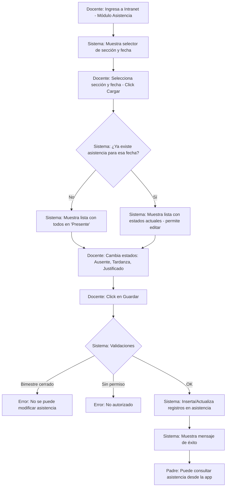

# Flujo: Registro de Asistencia

## 1. Diagrama de Actividad

## 2. Actores Involucrados

- **Docente**: Registra y modifica la asistencia.
- **Sistema**: Backend que procesa, valida y almacena la información.
- **Padre / Apoderado**: Consulta la asistencia de sus hijos.

---

## 3. Precondiciones

- Año lectivo en estado **“Abierto”**.
- Bimestre y unidad con fechas definidas y unidad abierta (`estado_abierto = TRUE`).
- Matrículas activas en la sección correspondiente.
- Docente autenticado con asignación vigente a la sección/curso en el año lectivo (`asignacion_docente`).
- Fecha seleccionada dentro del rango del bimestre/unidad abierta.

---

## 4. Descripción Paso a Paso

**Docente** → Ingresa a la intranet → Módulo **“Asistencia”**.

**Sistema** → Muestra formulario de filtros:
- Selector de **Sección** (solo las asignadas al docente en el año activo).
- Selector de **Fecha** (por defecto el día actual).
- Botón **“Cargar lista”**.

**Docente** → Selecciona la sección y la fecha deseada → Click en **“Cargar lista”**.

**Sistema**:
- Consulta la lista de alumnos con matrícula activa en esa sección  
  (`matricula` JOIN `estudiante` JOIN `persona`).
- Verifica si existen registros en `asistencia` para la combinación sección + fecha.

- **Si no existen registros previos**:
  - Muestra la lista completa de alumnos con estado por defecto **“Presente”**.
  - El docente puede modificar los estados.

- **Si ya existen registros previos**:
  - Muestra la lista con los estados guardados.
  - Permite editar los estados solo si la unidad correspondiente no está cerrada.

**Docente** → Cambia el estado de asistencia de los alumnos según corresponda:
- Estados disponibles:
  - Presente
  - Ausente
  - Tardanza
  - Justificado
- Puede cambiar estado alumno por alumno o usar una acción masiva (ej. **“Marcar todos como Presente”**) y luego ajustar casos especiales.
- Opcionalmente puede registrar una observación general del día.

**Docente** → Click en **“Guardar asistencia”**.

**Sistema** → Ejecuta validaciones (ver sección 5).

- **Si todas las validaciones son OK**:
  - Inserta nuevos registros en `asistencia` (si es la primera vez).
  - Actualiza los registros existentes (si es edición).
  - Muestra un mensaje de confirmación con la cantidad de alumnos procesados.

**Padre / Apoderado** → En la app de padres:
- Accede al módulo **“Asistencia”**.
- Selecciona a su hijo y un rango de fechas.
- Visualiza:
  - Resumen (porcentaje de asistencias, ausencias, tardanzas).
  - Detalle diario.
- Puede filtrar por bimestre o mes.

---

## 5. Validaciones y Reglas de Negocio

| # | Regla | Descripción |
|---|------|-------------|
| 1 | Unicidad diaria | Un alumno solo puede tener un registro de asistencia por día. La combinación `(id_matricula, fecha)` es única. |
| 2 | Unidad abierta | Solo se puede registrar o modificar asistencia si la unidad correspondiente está abierta (`unidad.estado_abierto = TRUE`). |
| 3 | Permiso del docente | El docente solo puede ver y modificar asistencia de las secciones que tiene asignadas en el año lectivo vigente. |
| 4 | Fecha dentro de rango | La fecha seleccionada debe pertenecer a un bimestre y unidad válidos del año lectivo activo. |
| 5 | Matrícula activa | Solo se listan alumnos con `matricula.estado_matricula = 'Activo'`. |
| 6 | Estados predefinidos | Estados válidos: **Presente, Ausente, Tardanza, Justificado**. |

---

## 6. Tablas Afectadas

| Paso | Tabla | Operación |
|-----|-------|-----------|
| Cargar lista de alumnos | `matricula`, `estudiante`, `persona` | SELECT |
| Cargar asistencia existente | `asistencia` | SELECT |
| Guardar nueva asistencia | `asistencia` | INSERT |
| Editar asistencia existente | `asistencia` | UPDATE |
| Verificar permisos | `asignacion_docente`, `seccion` | SELECT |
| Validar unidad abierta | `unidad`, `bimestre` | SELECT |
| Consulta de padre | `asistencia`, `matricula`, `estudiante` | SELECT |

---

## 7. Endpoints de la API

| Método | Ruta | Descripción |
|-------|------|-------------|
| GET | `/api/docente/secciones?anio_id={id}` | Obtener secciones asignadas al docente en un año lectivo |
| GET | `/api/docente/asistencia?seccion_id={id}&fecha={fecha}` | Obtener asistencia para una sección y fecha |
| POST | `/api/docente/asistencia` | Guardar o actualizar registros de asistencia |
| GET | `/api/unidades/abierta?fecha={fecha}` | Verificar si la unidad correspondiente a una fecha está abierta |
| GET | `/api/padres/asistencia?alumno_id={id}&desde={fecha}&hasta={fecha}` | Consulta de asistencia por rango de fechas |
| GET | `/api/padres/asistencia/resumen?alumno_id={id}&bimestre_id={id}` | Resumen de asistencia por bimestre |