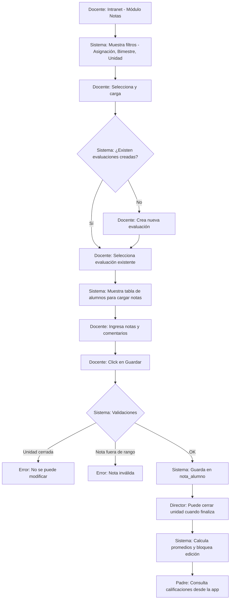
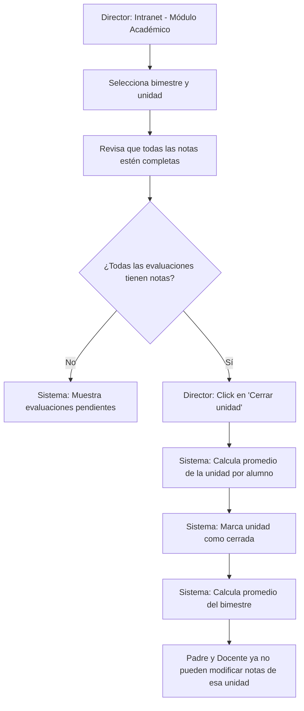

markdown
# Flujo: Registro de Calificaciones

## 1. Diagrama de Actividad

# Flujo alternativo: Cálculo de promedios y cierre de bimestre

## 2. Actores Involucrados

- **Docente**: Crea evaluaciones y registra notas.
- **Director**: Cierra unidades y bimestres, y supervisa el proceso académico.
- **Sistema**: Backend que gestiona validaciones, cálculos y almacenamiento.
- **Padre / Apoderado**: Consulta las calificaciones de sus hijos.

---

## 3. Precondiciones

- Año lectivo en estado **“Abierto”**.
- Bimestre y unidad con fechas definidas y unidad abierta (`unidad.estado_abierto = TRUE`).
- Docente con asignación vigente a la sección y curso (`asignacion_docente`).
- Escala de calificación configurada (`escala_calificacion`):
  - Nota mínima
  - Nota máxima
  - Nota aprobatoria
  - Tipo de escala
- Tipos de evaluación predefinidos (`tipo_evaluacion`):
  - Participación
  - Libro
  - Práctica
  - Examen
  - Otros
- Matrículas activas en la sección correspondiente.

---

## 4. Descripción Paso a Paso

### Flujo principal: Registro de notas

**Docente** → Ingresa a la intranet → Módulo **“Notas”** o **“Calificaciones”**.

**Sistema** → Muestra filtros en cascada:
- **Asignación**: Curso / sección que imparte el docente en el año activo.
- **Bimestre**: Lista de bimestres del año activo.
- **Unidad**: Lista de unidades del bimestre seleccionado, indicando si está abierta o cerrada.

**Docente** → Selecciona la combinación deseada → Click en **“Cargar”**.

**Sistema** → Busca las evaluaciones creadas para esa asignación y unidad (`evaluacion_detalle`).

- **Si no hay evaluaciones**:
  - Muestra mensaje: *“No hay evaluaciones creadas para esta unidad”*.
  - Muestra botón **“Crear nueva evaluación”**.

- **Si hay evaluaciones**:
  - Muestra una tabla con:
    - Tipo
    - Descripción
    - Fecha
  - Acciones:
    - **Ver / Editar notas**
    - **Crear nueva evaluación**

---

### Creación de evaluación

**Docente** → Crea una nueva evaluación:
- Selecciona **tipo de evaluación** (Participación, Práctica, Examen, etc.).
- Ingresa **descripción** (ej. “Práctica Calificada 1 - Fracciones”).
- Selecciona **fecha de evaluación**.
- Click en **“Crear”**.

---

### Registro de notas

**Docente** → Selecciona una evaluación existente.

**Sistema** → Muestra tabla con:
- **Filas**: Alumnos de la sección (orden alfabético).
- **Columnas**:
  - Campo de nota (input numérico).
  - Campo de comentario (opcional).
- Indicación visual del rango permitido (ej. *“0 - 20”*).

**Docente**:
- Ingresa notas y comentarios.
- Puede dejar alumnos sin nota (se guarda como `NULL`).
- Navega rápidamente usando teclado (Tab, Enter).

**Docente** → Click en **“Guardar notas”**.

**Sistema** → Ejecuta validaciones (ver sección 5).

- **Si todas las validaciones son OK**:
  - Inserta o actualiza registros en `nota_alumno`.
  - Muestra mensaje de éxito con la cantidad de notas guardadas.

**Docente** → Puede continuar con otras evaluaciones o volver al listado.

---

### Flujo alternativo: Cierre de unidad y cálculo de promedios

**Director** → Ingresa a la intranet → Módulo **“Académico”** → **“Gestión de Unidades”**.

**Sistema** → Muestra lista de bimestres y unidades del año activo con su estado.

**Director** → Selecciona una unidad abierta → Click en **“Ver estado”**.

**Sistema** → Muestra:
- Evaluaciones creadas para esa unidad (todas las secciones).
- Indicador de completitud (% de evaluaciones con todas las notas cargadas).
- Lista de evaluaciones pendientes (si existen).

**Director** → Si todo está completo → Click en **“Cerrar unidad”**.

**Sistema**:
- Calcula el promedio de la unidad por alumno (media de evaluaciones).
- Guarda el promedio como registro especial en `nota_alumno` (tipo **“Promedio Unidad”**).
- Cambia `unidad.estado_abierto` a `FALSE`.
- Si es la última unidad del bimestre:
  - Calcula el promedio del bimestre.

**Sistema** → Muestra confirmación y notifica a los docentes.

> **Consecuencia**:  
> Una unidad cerrada no permite modificación de notas, salvo que un **Admin** la reabra.

---

### Flujo de consulta (Padre / Apoderado)

**Padre** → App → Módulo **“Calificaciones”**.

**Sistema** → Muestra:
- Selector de hijo (si tiene varios).
- Selector de bimestre.

**Padre** → Selecciona hijo y bimestre → Click en **“Ver notas”**.

**Sistema** → Muestra:
- Tabla con:
  - Cursos (filas).
  - Evaluaciones, promedio de unidad y promedio de bimestre (columnas).
- Indicador visual de aprobado / desaprobado según `escala_calificacion.nota_aprobatoria`.
- Comentarios del docente (si existen).
- Promedio general del bimestre.

---

## 5. Validaciones y Reglas de Negocio

| # | Regla | Descripción |
|---|------|-------------|
| 1 | Unidad abierta | Solo se pueden crear evaluaciones y registrar notas si `unidad.estado_abierto = TRUE`. |
| 2 | Rango de nota | La nota debe estar dentro del rango definido en `escala_calificacion`. |
| 3 | Permiso del docente | El docente solo puede cargar notas de sus asignaciones vigentes. |
| 4 | Nota única | Un alumno no puede tener dos notas para la misma evaluación. `(id_matricula, id_evaluacion_det)` es único. |
| 5 | Cálculo de promedios | Promedio de unidad = media de evaluaciones. Promedio de bimestre = media de promedios de unidad. |
| 6 | Cierre controlado | Solo Director o Admin puede cerrar una unidad. No se reabre sin Admin. |
| 7 | Nota NULL permitida | Una nota puede ser `NULL` si el alumno no rindió. Su efecto depende de configuración. |
| 8 | Escala parametrizable | El sistema se adapta a escala Numérica, Literal o de Logros. |

---

## 6. Tablas Afectadas

| Paso | Tabla | Operación |
|-----|-------|-----------|
| Cargar asignaciones | `asignacion_docente`, `curso`, `seccion` | SELECT |
| Listar bimestres y unidades | `bimestre`, `unidad` | SELECT |
| Crear evaluación | `evaluacion_detalle` | INSERT |
| Cargar evaluaciones | `evaluacion_detalle` | SELECT |
| Cargar alumnos | `matricula`, `estudiante`, `persona` | SELECT |
| Guardar / editar notas | `nota_alumno` | INSERT / UPDATE |
| Cerrar unidad | `unidad` | UPDATE |
| Guardar promedios | `nota_alumno` | INSERT |
| Consulta de padre | `nota_alumno`, `evaluacion_detalle`, `curso`, `matricula` | SELECT |

---

## 7. Endpoints de la API

| Método | Ruta | Descripción |
|-------|------|-------------|
| GET | `/api/docente/asignaciones?anio_id={id}` | Asignaciones del docente en el año activo |
| GET | `/api/bimestres?anio_id={id}` | Listar bimestres del año lectivo |
| GET | `/api/unidades?bimestre_id={id}` | Listar unidades de un bimestre con su estado |
| POST | `/api/evaluaciones` | Crear nueva evaluación |
| GET | `/api/evaluaciones?asignacion_id={id}&unidad_id={id}` | Listar evaluaciones por asignación y unidad |
| GET | `/api/evaluaciones/{id}/notas` | Obtener notas de una evaluación |
| POST | `/api/evaluaciones/{id}/notas` | Guardar o actualizar notas |
| PUT | `/api/unidades/{id}/cerrar` | (Director) Cerrar unidad y calcular promedios |
| GET | `/api/unidades/{id}/estado` | Ver estado de completitud de la unidad |
| GET | `/api/padres/notas?alumno_id={id}&bimestre_id={id}` | Consulta de notas por bimestre |
| GET | `/api/padres/boletin?alumno_id={id}&anio_id={id}` | Boletín anual completo |