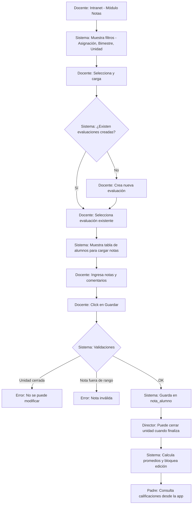
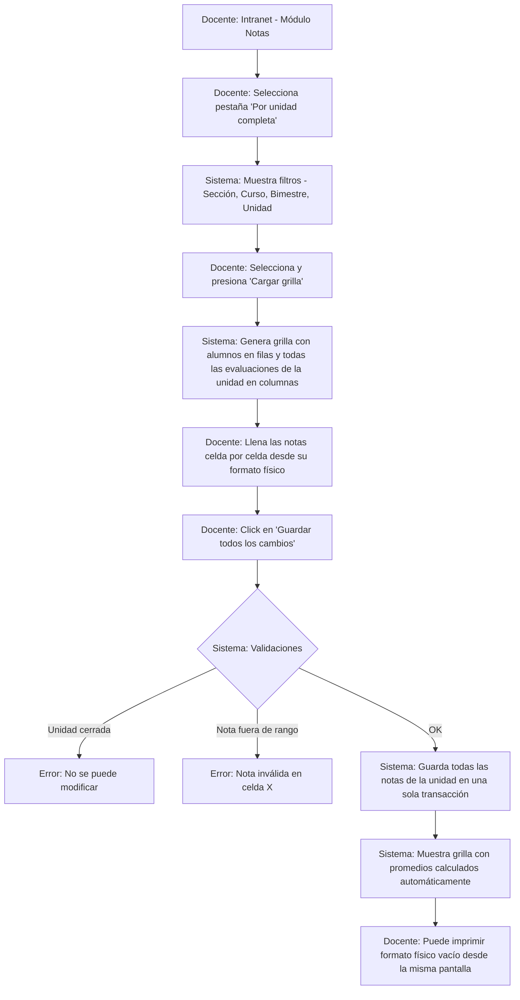
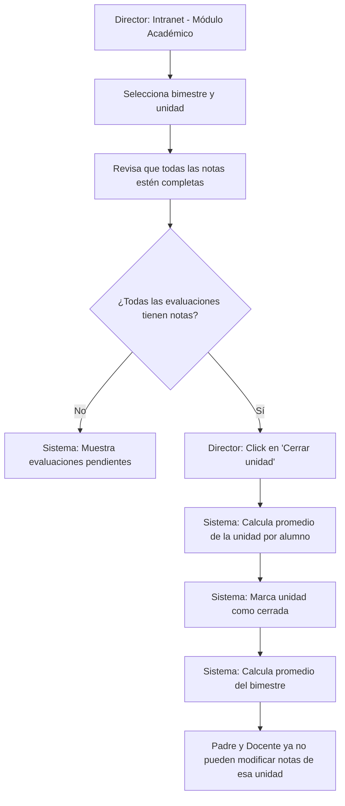

# Flujo: Registro de Calificaciones

## 1. Diagrama de Actividad

### Modo A: Registro por evaluación individual

### Modo B: Registro masivo por unidad completa (grilla)

# Flujo adicional: Cierre de unidad y cálculo de promedios

## 2. Actores Involucrados

- **Docente**  
  Crea evaluaciones y registra notas, en modo individual o masivo.

- **Director**  
  Cierra unidades y bimestres, supervisa.

- **Sistema**  
  Backend de la aplicación.

- **Padre / Apoderado**  
  Consulta calificaciones.

---

## 3. Precondiciones

- Año lectivo en estado **"Abierto"**.
- Bimestre y unidad con fechas definidas y unidad abierta  
  (`unidad.estado_abierto = TRUE`).
- Docente con asignación vigente (`asignacion_docente`) a la sección y curso.
- Escala de calificación configurada (`escala_calificacion`):  
  nota mínima, máxima, aprobatoria y tipo.
- Tipos de evaluación predefinidos (`tipo_evaluacion`):  
  Participación, Libro, Práctica, Examen, etc.
- Matrículas activas en la sección correspondiente.
- Para el **modo B (grilla)**:  
  evaluaciones ya creadas para la unidad (`evaluacion_detalle`).

---

## 4. Descripción Paso a Paso

### Modo A: Registro por evaluación individual

1. **Docente** → Ingresa a la intranet → Módulo **"Notas"** o **"Calificaciones"**.
2. **Sistema** → Muestra filtros en cascada:
   - Asignación (curso/sección del docente en el año activo).
   - Bimestre (del año activo).
   - Unidad (del bimestre seleccionado, indicando si está abierta o cerrada).
3. **Docente** → Selecciona la combinación deseada y presiona **"Cargar"**.
4. **Sistema** → Busca evaluaciones creadas para esa asignación y unidad  
   (`evaluacion_detalle`).
   - Si no hay evaluaciones:  
     Muestra el mensaje  
     **"No hay evaluaciones creadas para esta unidad"**  
     y el botón **"Crear nueva evaluación"**.
   - Si hay evaluaciones:  
     Muestra una tabla con evaluaciones existentes (tipo, descripción, fecha)  
     y botones **"Ver/Editar notas"** o **"Crear nueva evaluación"**.
5. **Docente** → Puede crear una nueva evaluación:
   - Selecciona tipo de evaluación (Participación, Práctica, Examen, etc.).
   - Ingresa descripción  
     (ej. *"Práctica Calificada 1 - Fracciones"*).
   - Selecciona fecha de evaluación.
   - Click en **"Crear"**.
6. **Docente** → Selecciona una evaluación existente para cargar notas.
7. **Sistema** → Muestra una tabla con:
   - Filas: alumnos de la sección (orden alfabético).
   - Columnas: campo de nota (input numérico) y comentario (opcional).
   - Indicación visual del rango permitido (ej. *"0 - 20"*).
8. **Docente** → Ingresa notas y comentarios.
9. **Docente** → Click en **"Guardar notas"**.
10. **Sistema** → Ejecuta validaciones (ver sección 5).
    - Si todo es correcto:
      - Inserta o actualiza registros en `nota_alumno`.
      - Muestra mensaje de éxito con la cantidad de notas guardadas.

---

### Modo B: Registro masivo por unidad completa (grilla)

1. **Docente** → Ingresa a la intranet → Módulo **"Notas"**.
2. **Docente** → Selecciona la pestaña o toggle **"Por unidad completa"**.
3. **Sistema** → Muestra filtros:
   - Sección
   - Curso
   - Bimestre
   - Unidad
4. **Docente** → Selecciona filtros y presiona **"Cargar grilla"**.
5. **Sistema** → Genera una grilla dinámica:
   - Filas: alumnos con matrícula activa.
   - Columnas: una por cada evaluación de la unidad  
     (`evaluacion_detalle`) + columna final **Promedio** (automático).
   - Celdas: campos numéricos pequeños.
   - Notas previas aparecen precargadas.
6. **Docente** → Ingresa las notas directamente en la grilla.
   - Validación visual en tiempo real:
     - Valores fuera de rango se resaltan en rojo.
   - El promedio se recalcula automáticamente.
7. **Docente** → Presiona **"Guardar todos los cambios"**.
8. **Sistema** → Ejecuta validaciones para todas las celdas.
   - Si todo es correcto:
     - Guarda todas las notas en una única transacción.
     - Muestra mensaje de éxito con la cantidad de registros actualizados.
     - La grilla permanece visible con promedios actualizados.
9. **Docente** → (Opcional) **"Imprimir formato físico"**:
   - Genera un PDF con la misma grilla, celdas en blanco, listo para aula.

---

## 5. Validaciones y Reglas de Negocio

| # | Regla | Descripción |
|---|------|-------------|
| 1 | Unidad abierta | Solo se permite registrar notas si `unidad.estado_abierto = TRUE`. |
| 2 | Rango de nota | La nota debe estar dentro del rango definido por `escala_calificacion`. |
| 3 | Permiso del docente | El docente solo carga notas en sus asignaciones. |
| 4 | Nota única | Un alumno no puede tener dos notas para la misma evaluación. |
| 5 | Cálculo de promedios | Media aritmética de evaluaciones por unidad. Visible en tiempo real en modo B. |
| 6 | Cierre controlado | Solo Director o Admin puede cerrar unidades. |
| 7 | Nota NULL | Permitida si el alumno no rindió la evaluación. |
| 8 | Transaccionalidad | En modo B, si una celda falla, se rechaza todo el lote. |
| 9 | Formato físico | El sistema debe generar PDF con grilla vacía imprimible. |

---

## 6. Tablas Afectadas

| Paso | Tabla | Operación |
|-----|-------|-----------|
| Cargar asignaciones | asignacion_docente, curso, seccion | SELECT |
| Listar bimestres/unidades | bimestre, unidad | SELECT |
| Crear evaluación | evaluacion_detalle | INSERT |
| Cargar evaluaciones | evaluacion_detalle | SELECT |
| Listar alumnos | matricula, estudiante, persona | SELECT |
| Guardar notas (Modo A) | nota_alumno | INSERT / UPDATE |
| Guardar notas (Modo B) | nota_alumno | INSERT / UPDATE masivo |
| Cerrar unidad | unidad | UPDATE |
| Guardar promedios | nota_alumno | INSERT |
| Consulta de padre | nota_alumno, evaluacion_detalle, curso, matricula | SELECT |

---

## 7. Endpoints de la API

| Método | Ruta | Descripción |
|------|------|-------------|
| GET | /api/docente/asignaciones?anio_id={id} | Asignaciones del docente |
| GET | /api/bimestres?anio_id={id} | Listar bimestres |
| GET | /api/unidades?bimestre_id={id} | Unidades por bimestre |
| POST | /api/evaluaciones | Crear evaluación |
| GET | /api/evaluaciones?asignacion_id={id}&unidad_id={id} | Listar evaluaciones |
| GET | /api/evaluaciones/{id}/notas | Notas por evaluación |
| POST | /api/evaluaciones/{id}/notas | Guardar notas (Modo A) |
| GET | /api/unidades/{id}/grilla | Grilla de unidad (Modo B) |
| PUT | /api/unidades/{id}/notas | Guardar notas masivas |
| PUT | /api/unidades/{id}/cerrar | Cerrar unidad |
| GET | /api/unidades/{id}/estado | Estado de unidad |
| GET | /api/padres/notas?alumno_id={id}&bimestre_id={id} | Consulta de notas |
| GET | /api/padres/boletin?alumno_id={id}&anio_id={id} | Boletín anual |
| GET | /api/unidades/{id}/formato-fisico | PDF con grilla vacía |

---

## 📌 Resumen de cambios realizados

| Sección | Cambio |
|---------|--------|
| Diagramas Mermaid | Se agregó el **Modo B: Registro masivo por unidad completa** con su propio diagrama. |
| Descripción paso a paso | Se añadió el paso a paso del Modo B (grilla completa), reflejando el flujo real del colegio: llenar desde formato físico. |
| Validaciones | Se agregaron reglas #8 (transaccionalidad en modo B) y #9 (formato físico imprimible). |
| Tablas afectadas | Se diferenció entre guardar notas en modo A (individual) y modo B (masivo). |
| Endpoints | Se agregaron 3 nuevos endpoints: `GET /api/unidades/{id}/grilla`, `PUT /api/unidades/{id}/notas`, `GET /api/unidades/{id}/formato-fisico`. |