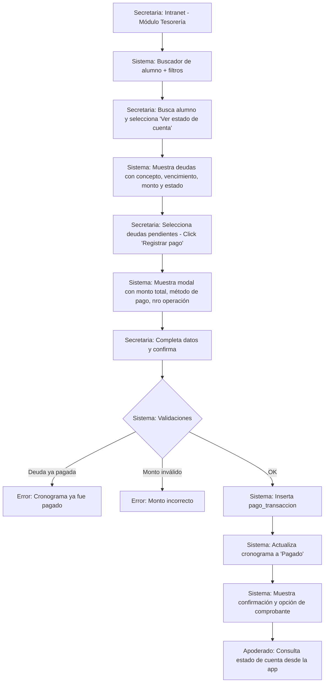
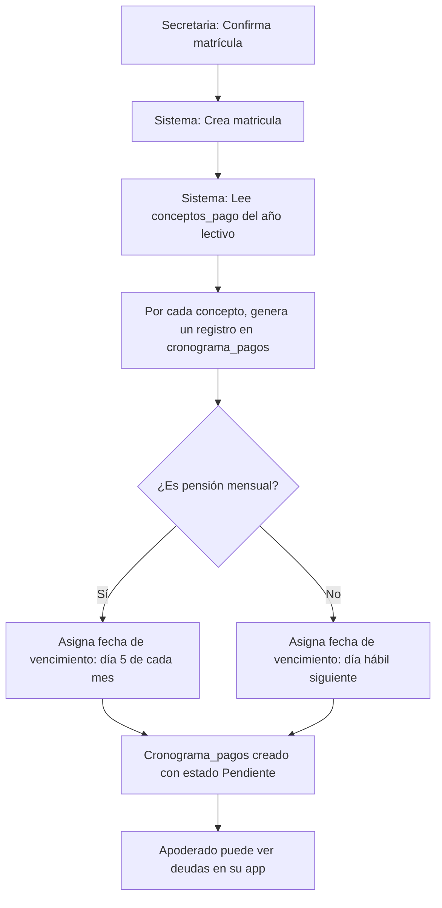
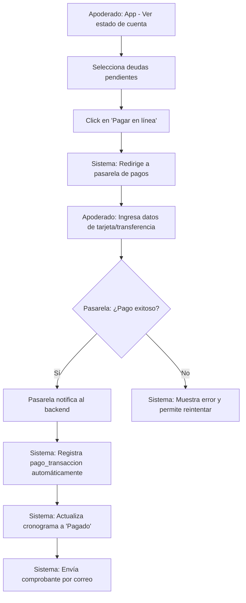

markdown
# Flujo: Gestión de Pagos

## 1. Diagrama de Actividad

# Flujo alternativo: Generación automática de deuda al matricular

# Flujo alternativo: Pago en línea con pasarela (opcional)

## 2. Actores Involucrados

- **Secretaria / Cajero**: Registra pagos presenciales o transferencias manuales.
- **Sistema**: Backend que gestiona validaciones, estados de deuda y registros.
- **Apoderado**: Consulta el estado de cuenta y opcionalmente realiza pagos en línea.
- **Pasarela de pagos** (opcional): Stripe, MercadoPago u otra plataforma de cobros en línea.

---

## 3. Precondiciones

- Matrícula activa del alumno en el año lectivo.
- Conceptos de pago creados para el año lectivo (`concepto_pago`).
- Cronograma de pagos generado automáticamente al momento de la matrícula (`cronograma_pagos`).
- Usuario autenticado con rol **Secretaria**, **Cajero** o **Admin** para registrar pagos.
- Si se utiliza pasarela de pagos:
  - Credenciales válidas.
  - Configuración activa de la pasarela.

---

## 4. Descripción Paso a Paso

### Flujo principal: Registro de pago por secretaria

**Secretaria** → Ingresa a la intranet → Módulo **“Tesorería”** o **“Pagos”**.

**Sistema** → Muestra:
- Buscador de alumno (por DNI, apellidos o código de estudiante).
- Filtros:
  - Estado de deuda: *Pendiente*, *Pagado*, *Vencido*.
  - Rango de fechas de vencimiento.

**Secretaria** → Busca al alumno → Selecciona **“Ver estado de cuenta”**.

**Sistema** → Muestra la tabla de estado de cuenta:
- Concepto (ej. *Pensión Marzo 2026*, *Matrícula 2026*).
- Fecha de vencimiento.
- Monto original.
- Saldo pendiente (si se permiten pagos parciales) o monto total.
- Estado: *Pendiente*, *Pagado*, *Vencido*.
- Checkbox para seleccionar una o más deudas.

**Secretaria** → Selecciona deudas en estado *Pendiente* o *Vencido* → Click en **“Registrar pago”**.

**Sistema** → Muestra un formulario/modal con:
- Detalle de deudas seleccionadas.
- Monto total a pagar (suma automática de saldos pendientes).
- Selector de método de pago:
  - Efectivo
  - Transferencia
  - Tarjeta
- Campo **“Número de operación”**:
  - Obligatorio para *Transferencia*.
  - Opcional para otros métodos.
- Fecha de pago (por defecto la actual, editable).

**Secretaria** → Completa los datos → Click en **“Confirmar pago”**.

**Sistema** → Ejecuta validaciones (ver sección 5).

- **Si las validaciones son OK**:
  - Inserta un registro en `pago_transaccion` por cada deuda pagada.
  - Actualiza `cronograma_pagos.estado_pago` a **“Pagado”**.
  - Muestra mensaje de confirmación con el resumen de la transacción.
  - Opcional:
    - Genera comprobante en PDF para imprimir o descargar.
    - Envía el comprobante al correo del apoderado.

---

### Acciones del apoderado (consulta)

**Apoderado** → App de padres:
- Accede al módulo **“Pagos”** o **“Estado de cuenta”**.
- Visualiza:
  - Lista de deudas y su estado.
  - Historial de pagos (fecha, monto, método).
- Si la pasarela está habilitada, puede pagar en línea.

---

### Flujo alternativo: Pago en línea con pasarela

**Apoderado** → App → **“Estado de cuenta”** → Selecciona deudas pendientes.

**Sistema** → Calcula el monto total → Muestra botón **“Pagar en línea”**.

**Apoderado** → Click en **“Pagar en línea”**.

**Sistema**:
- Crea una sesión de pago en la pasarela (Stripe, MercadoPago).
- Redirige al apoderado a la pasarela.

**Apoderado** → Completa el pago en la pasarela.

**Pasarela** → Notifica al backend mediante **webhook**.

**Sistema**:
- Verifica la firma del webhook.
- Registra automáticamente `pago_transaccion`.
- Actualiza `cronograma_pagos`.
- Envía notificación push y correo con el comprobante.

---

## 5. Validaciones y Reglas de Negocio

| # | Regla | Descripción |
|---|------|-------------|
| 1 | Deuda no pagada | Solo se pueden pagar deudas en estado **Pendiente** o **Vencido**. |
| 2 | Monto válido | El monto debe ser mayor a cero y no exceder el saldo pendiente. |
| 3 | Permiso de cajero | Solo roles **Secretaria**, **Cajero** o **Admin** registran pagos manuales. |
| 4 | Método de pago | Debe ser uno de: **Efectivo**, **Transferencia**, **Tarjeta**. |
| 5 | Número de operación | Obligatorio si el método es **Transferencia**. |
| 6 | Generación automática | Las deudas se generan al crear la matrícula según `concepto_pago`. |
| 7 | Vencimiento | Proceso batch diario marca como **Vencido** lo pendiente fuera de fecha. |
| 8 | Pago parcial | Opcional. Reduce el saldo pendiente si está habilitado. |

---

## 6. Tablas Afectadas

| Paso | Tabla | Operación |
|-----|-------|-----------|
| Buscar alumno | `persona`, `estudiante`, `matricula` | SELECT |
| Ver estado de cuenta | `cronograma_pagos`, `concepto_pago`, `pago_transaccion` | SELECT |
| Registrar pago manual | `pago_transaccion` | INSERT |
| Actualizar estado de deuda | `cronograma_pagos` | UPDATE |
| Generar deuda automática | `cronograma_pagos` | INSERT múltiple |
| Consulta de apoderado | `cronograma_pagos`, `concepto_pago`, `pago_transaccion`, `apoderado_estudiante` | SELECT |
| Proceso batch de vencimiento | `cronograma_pagos` | UPDATE masivo |

---

## 7. Endpoints de la API

| Método | Ruta | Descripción |
|-------|------|-------------|
| GET | `/api/tesoreria/buscar-alumno?dni={dni}&apellidos={texto}` | Buscar alumno y matrícula activa |
| GET | `/api/tesoreria/estado-cuenta/{matricula_id}` | Deudas y pagos de una matrícula |
| POST | `/api/tesoreria/pagos` | Registrar pago manual |
| GET | `/api/tesoreria/comprobante/{transaccion_id}` | Generar comprobante PDF |
| GET | `/api/tesoreria/cronogramas-vencidos` | Listar cronogramas vencidos |
| PUT | `/api/tesoreria/marcar-vencidos` | Marcar cronogramas como vencidos |
| GET | `/api/padres/deudas/{alumno_id}` | Estado de cuenta del apoderado |
| GET | `/api/padres/pagos/{alumno_id}` | Historial de pagos |
| POST | `/api/padres/pagos/en-linea` | Crear sesión de pago en pasarela |
| POST | `/api/webhooks/pagos` | Webhook de confirmación de pago |
