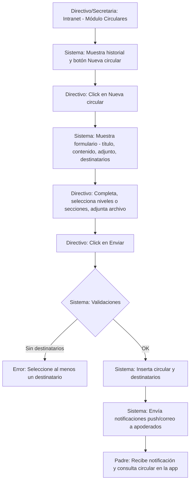
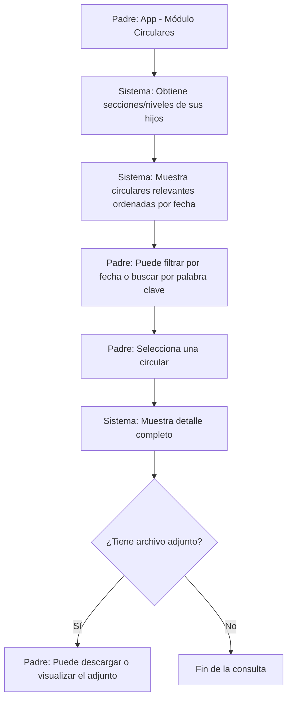

markdown
# Flujo: Envío de Circulares

## 1. Diagrama de Actividad

# Flujo alternativo: Consulta de circulares por el padre

## 2. Actores Involucrados

- **Directivo / Secretaria**: Redacta y envía circulares.
- **Sistema**: Backend que gestiona el registro, segmentación y notificación.
- **Padre / Apoderado**: Recibe notificaciones y consulta las circulares.

---

## 3. Precondiciones

- Usuario autenticado con rol **Director**, **Directivo** o **Secretaria** para enviar circulares.
- Niveles y secciones configurados en el año lectivo activo.
- Destinatarios definidos:
  - Todo el colegio.
  - Un nivel específico (Inicial, Primaria, Secundaria).
  - Una o varias secciones específicas.
- (Opcional) Servicio de notificaciones push y correo electrónico configurado.

---

## 4. Descripción Paso a Paso

### Flujo principal: Creación y envío de circular

**Directivo / Secretaria** → Ingresa a la intranet → Módulo **“Comunicaciones”** o **“Circulares”**.

**Sistema** → Muestra:
- Historial de circulares enviadas (paginado, ordenado por fecha descendente).
- Para cada circular:
  - Título
  - Fecha de creación
  - Remitente
  - Cantidad estimada de destinatarios
- Botón destacado **“Nueva circular”**.

**Directivo** → Click en **“Nueva circular”**.

**Sistema** → Muestra formulario de creación:
- **Título**:
  - Campo obligatorio
  - Máximo 150 caracteres
- **Contenido**:
  - Editor de texto enriquecido o textarea amplio
  - Campo obligatorio
- **Adjunto** (opcional):
  - PDF o imágenes JPG/PNG (tamaño máximo configurable)
- **Destinatarios** (checkboxes o selectores múltiples):
  - Niveles completos: Inicial, Primaria, Secundaria
  - Secciones específicas (al seleccionar un nivel, se muestran sus secciones)
  - Opción **“Todo el colegio”** (selecciona todos los niveles y secciones)

**Directivo**:
- Redacta el mensaje.
- Adjunta archivo si corresponde (ej. autorización en PDF).
- Selecciona destinatarios (ej. solo *Primaria* o secciones *1°A* y *2°B*).

**Directivo** → Click en **“Enviar circular”**.

**Sistema** → Ejecuta validaciones (ver sección 5).

- **Si todas las validaciones son OK**:
  - Inserta el registro en `circular`.
  - Inserta los registros en `circular_destinatario` por cada nivel o sección seleccionada.
  - Si se eligió *Todo el colegio*, se registran todos los niveles.
  - Inicia proceso de notificación:
    - Identifica apoderados según niveles/secciones de sus hijos.
    - Envía notificación push (ej. Firebase Cloud Messaging).
    - Opcionalmente envía correo electrónico con el contenido o enlace.
    - Adjunta archivo si corresponde.
  - Muestra mensaje de confirmación:  
    **“Circular enviada exitosamente a [cantidad] destinatarios”**.

---

### Flujo alternativo: Consulta de circulares por el padre

**Padre / Apoderado** → Abre la app → Módulo **“Circulares”** o **“Comunicados”**.

**Sistema**:
- Identifica a los hijos del apoderado y sus matrículas activas.
- Determina niveles y secciones correspondientes.
- Consulta las circulares cuyos destinatarios coinciden con esos niveles/secciones.
- Ordena por fecha de creación descendente.

**Sistema** → Muestra bandeja de circulares:
- Título
- Fecha
- Remitente
- Indicador de adjunto
- Opciones:
  - Filtrar por fecha
  - Buscar por palabra clave (título o contenido)

**Padre** → Selecciona una circular.

**Sistema**:
- Muestra el contenido completo.
- Permite descargar el adjunto (si existe).
- Marca la circular como **“leída”** (opcional, si se implementa seguimiento).

---

## 5. Validaciones y Reglas de Negocio

| # | Regla | Descripción |
|---|------|-------------|
| 1 | Al menos un destinatario | Se debe seleccionar al menos un nivel o sección. |
| 2 | Título obligatorio | El título no puede estar vacío y debe tener mínimo 3 caracteres. |
| 3 | Contenido obligatorio | El cuerpo de la circular no puede estar vacío. |
| 4 | Permiso de envío | Solo roles **Director**, **Directivo**, **Secretaria** y **Admin** pueden enviar. |
| 5 | Tamaño de adjunto | El adjunto no debe superar el tamaño máximo establecido (ej. 10 MB). |
| 6 | Tipos de archivo permitidos | Solo PDF, JPG, PNG, DOCX (configurable). |
| 7 | Filtrado automático | El padre solo ve circulares dirigidas a sus niveles o secciones. |
| 8 | Historial inmutable | Una circular enviada no se puede editar; solo eliminar (soft delete) o reenviar. |

---

## 6. Tablas Afectadas

| Paso | Tabla | Operación |
|-----|-------|-----------|
| Listar historial | `circular`, `usuario` | SELECT |
| Crear circular | `circular` | INSERT |
| Registrar destinatarios | `circular_destinatario` | INSERT múltiple |
| Notificar apoderados | `apoderado_estudiante`, `matricula`, `usuario` | SELECT |
| Consulta de padre | `circular`, `circular_destinatario`, `apoderado_estudiante`, `matricula` | SELECT |
| Subir adjunto | `circular` / `archivo_adjunto` | UPDATE |

---

## 7. Endpoints de la API

| Método | Ruta | Descripción |
|-------|------|-------------|
| GET | `/api/circulares?pagina={n}&limite={n}` | Listar historial de circulares (intranet) |
| GET | `/api/circulares/{id}` | Ver detalle de una circular |
| POST | `/api/circulares` | Crear y enviar circular |
| DELETE | `/api/circulares/{id}` | (Admin) Eliminar circular (soft delete) |
| GET | `/api/niveles` | Listar niveles para destinatarios |
| GET | `/api/secciones?nivel_id={id}` | Listar secciones por nivel |
| POST | `/api/circulares/{id}/adjunto` | Subir adjunto |
| GET | `/api/padres/circulares?alumno_id={id}&pagina={n}` | Circulares del apoderado |
| GET | `/api/padres/circulares/{id}` | Detalle de circular (app padres) |